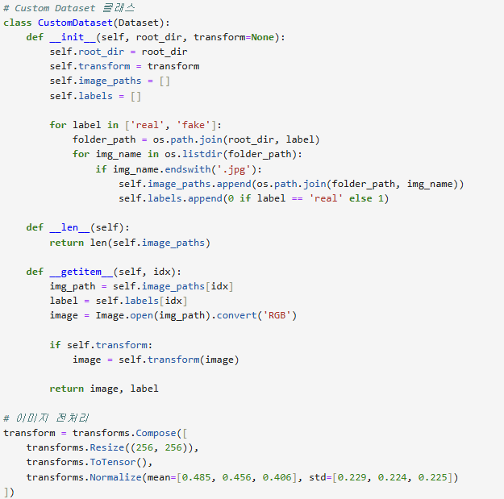
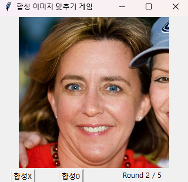

# Project2
## CNN을 이용한 이미지 합성 여부 예측 모델 및 이를 활용한 게임

CNN을 이용하여 이미지 합성 여부 판단하는 모델을 만들었습니다. 그리고 모델을 저장하여 사용자가 저장된 모델과 이미지 합성 여부를 맞추며 겨루는 게임 프로그램을 만들었습니다.

이 프로젝트에서 CNN을 선택하여 활용한 이유는 다음과 같습니다. CNN은 주로 이미지나 영상 데이터 분석에 많이 사용되는 딥러닝 알고리즘입니다. CNN은 인간의 시각적 처리 방식에서 영감을 받아, 이미지를 인식하고 분류하는 데 뛰어난 성능을 보입니다.

이미지 데이터셋 설명: 사람의 얼굴 이미지들이 담겨있는 폴더입니다.

이미지 데이터셋(DataSet3) 출처:https://www.kaggle.com/datasets/shivamardeshna/real-and-fake-images-dataset-for-image-forensics

 

## $\bf{\color{#6580DD}목차}$

1. 모티베이션

2. 모델 설명 및 학습&테스트 결과

3. 게임 설명 및 실행 결과

4. 더 나아가...

 

## $\bf{\color{#6580DD}1. 모티베이션}$

어떤 프로젝트를 할지 고민하다가 '비밀의 숲'이라는 추리드라마에서 주인공이 블랙박스 영상을 전문가에게 주며 조작된 것인지 묻는 장면을 보고 주제를 정하게 되었습니다. 전문가가 이미지를 확대해보고 '조작되지 않았다.'라고 말합니다. 이때, 저는 전문가가 이미지의 어느 부분을 보고 조작되지 않은 것으로 판단을 하는 것인지 궁금증이 생겼고 이 궁금증이 주제를 정하는 출발점이 되었습니다. 현재 딥페이크와 같은 기술이 발전하면서, 사람으로서는 합성된 이미지를 보고 합성 여부를 알기 어렵습니다. 기계합습을 통한 모델로 사람보다 합성 여부를 더 잘 판단하게 하여 합성 이미지의 악의적 이용으로 인한 사회적 문제가 해결되면 좋겠다는 생각에 이미지가 조작되었는지 예측하는 모델을 만들게 되었습니다. 이후, 저장된 모델과 사람인 사용자가 주어진 이미지를 보고 합성되었는지 예측해보고 결과를 확인하며 누가 더 잘 맞추는지 겨루는 게임을 만들었습니다.

 

## $\bf{\color{#6580DD}2. 모델 설명 및 학습*테스트 결과}$
### 1. 라이브러리 Import

프로젝트에 필요한 라이브러리를 불러옵니다.

 

### 2. 데이터셋 전처리

데이터 경로 설명: train 폴더, test 폴더, validation 폴더에 각각 또 real폴더와 fake폴더가 있어서 real 폴더 안에는 합성이 되지 않은 사람의 얼굴 이미지가 있고 fake 폴더 안에는 합성이 된 사람의 얼굴 이미지가 있습니다.

PyTorch의 Dataset 클래스를 확장하여 데이터를 로드하고 전처리하는 데이터셋 클래스를 정의합니다. 폴더 내 모든 이미지 경로와 레이블(합성 이미지는 1, 아니면 0)을 반환합니다. 이후 이미지 데이터를 CNN 모델에 적합하게 변환하는 전처리를 합니다. transforms를 사용하여 이미지를 크기 조정하고 텐서로 변환하며, 정규화합니다.

 
   
### 3. 데이터 로더

훈련, 검증, 테스트 데이터셋을 로드하기 위해 DataLoader를 사용합니다.

 

### 4. CNN 모델

ResNet18을 기반으로 하는 CNN 모델을 사용합니다. pretrained=True를 설정하여 ImageNet으로 미리 학습된 가중치를 사용할 수 있습니다.

 

### 5. 모델 훈련

모델을 훈련하기 위해 손실 함수와 옵티마이저를 정의하고, 훈련 루프를 구현합니다.

 

###  6. 모델 평가 테스트 및 모델 저장

훈련이 끝난 후, 검증 데이터셋을 사용하여 평가모드(eval)로 설정 후 모델의 최종 성능을 평가합니다. 이후 모델을 저장합니다.

 

###  모델 훈련 loss값과 정확도 및 모델 테스트 정확도

모델의 훈련 loss값이 점점 0으로 다가가는 것을 확인할 수 있고 정확도도 올라감을 확인할 수 있습니다. 모델의 테스트 결과 정확도는 약 60%입니다. 테스트 정확도에 관하여, 현재 딥페이크 기술이 발전하면서 합성된 사람 얼굴에 대한 이미지의 정교도가 높기 때문에 이미지에 따라서 모델이 예측 정확도가 떨어질 수 있습니다. 예를 들어, GAN을 사용하여 합성된 얼굴은 자연스럽게 보일 수 있습니다. 이런 고급 합성 얼굴은 일반적인 CNN만으로는 정확히 구별하기 어려울 수 있습니다. 더 복잡한 모델을 만들거나 훈련 시간을 더 늘리는 방법을 통하여 정확도를 개선할 수 있을 것입니다.

 

## $\bf{\color{#6580DD}3. 게임 설명 및 실행 결과}$
###  게임 설명

1. 이미지 제공: 게임이 시작되면 DataSet3/test에서 임의로 real 또는 fake 폴더에서 가져옵니다. real 폴더에는 합성되지 않은 이미지, fake 폴더에는 합성된 이미지가 있습니다. 각 이미지가 real인지 fake인지 레이블에 저장해놓습니다.

2. 사용자 입력: 사용자는 주어진 이미지를 보고 "합성0" 또는 "합성X" 버튼을 눌러 예측합니다.

3. 모델 예측: 사전 훈련된 모델은 같은 이미지를 보고 "합성0" 또는 "합성X"를 예측합니다.

4. 점수 계산: 각각 정답을 맟추었는지 여부에 따라 점수를 얻습니다.

5. 게임 종료: 5 라운드를 진행하고 게임이 종료되며, 총 라운드에서 얻은 점수의 합이 최종 점수됩니다.

 

파일 내부는 위와 같습니다.

 

### 코드 설명
#### 1. 모델 로드

저장된 모델을 불러오고 모델이 예측하는 함수를 만듭니다.

 

#### 2. GUI

Tkinter를 사용하여 GUI를 만듭니다.

 

###  코드 실행 결과

UI는 tkinter를 사용하여 구현하였습니다. 저장된 모델을 불러오고 임의로 고를 이미지를 불러와 게임을 진행합니다. 실행 결과는 다음과 같습니다.

이미지가 주어져있고 이미지 아래에 버튼 두 개가 있어 합성 이미지로 예측되는지 아닌지 사용자가 고를 수 있습니다. 버튼 오른쪽에 몇 라운드가 진행중인지도 함께 주어집니다. 아래 이미지는 버튼을 눌렀을 때, 나오는 창입니다.

내 예측과 모델의 예측이 각각 무엇이었는지와 정답은 무엇인지 주어집니다. 그리고 점수를 맞추었다면 1점이 더해집니다. 위 이미지는 1라운드에서 사용자와 모델이 각각 1점인 상태에서 2라운의 사용자의 예측은 틀렸고 모델의 예측은 맞아서 각각 총 1점과 2점이 된 상태입니다.

 

## $\bf{\color{#6580DD}4. 더 나아가...}$
### 의의

추리드라마 '비밀의 숲'의 한 장면을 보고 시작된 프로젝트이지만, 프로젝트를 하면서 이러한 얼굴에 대한 합성 여부를 판단하는 모델이 이 시대에 중요한 역할을 할 수 있겠다라는 생각이 들었습니다. 왜냐하면, 딥페이크와 같은 기술이 발전함에 따라 사회에서 딥페이크에 대한 문제가 생기기도 합니다. 사람으로서는 이미지를 보고 합성의 여부를 판단하는 것이 점점 어려워지고 있습니다. 이때, 이러한 합성 여부 판단 모델을 발전시킴에 따라 이러한 문제를 해결하는데 도움이 될 것이라고 생각합니다.

 

### 보안점

제가 만든 모델의 개선할 방법을 생각해보면 전이 학습을 시켜 사전에 잘 학습된 모델의 기반으로 학습시키는 것입니다. 또는, 이미지에 회전이나 크기 변화 또는 색상 변화를 통해 다양한 환경에서 분포하도록 하여 모델을 더 잘 학습시킬 수 있을 것입니다.

 

### 느낀점

게임에 대한 느낀점은 사람이 이미지를 보고 합성 여부를 판단하는 것이 쉽지 않다는 것입니다. 합성한 이미지처럼 느껴지지만 합성 이미지가 아니기도 하였습니다. 합성 이미지를 사람이 판단하는 기술이 무엇이 있는지 궁금해지기도 하였고 전문가가 이 게임을 한다면 어떤 결과가 나올지 궁금하다는 생각도 들었습니다. 이미지 합성을 악의적으로 이용할 때, 무서운 결과가 나올 수 있다는 것을 다시 느꼈던 시간이었습니다.

 

